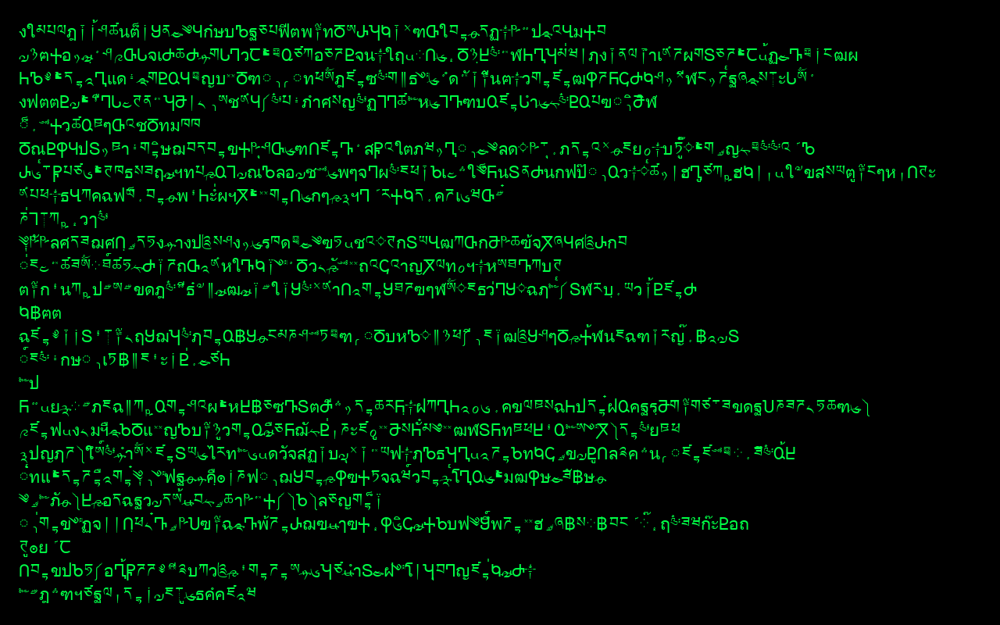

# RunTASCIIc

```
88888888ba                     888888888888   db        ad88888ba    ,ad8888ba,  88 88   ,ad8888ba,
88      "8b                         88       d88b      d8"     "8b  d8"'    `"8b 88 88  d8"'    `"8b
88      ,8P                         88      d8'`8b     Y8,         d8'           88 88 d8'
88aaaaaa8P' 88       88 8b,dPPYba,  88     d8'  `8b    `Y8aaaaa,   88            88 88 88
88""""88'   88       88 88P'   `"8a 88    d8YaaaaY8b     `"""""8b, 88            88 88 88
88    `8b   88       88 88       88 88   d8""""""""8b          `8b Y8,           88 88 Y8,
88     `8b  "8a,   ,a88 88       88 88  d8'        `8b Y8a     a8P  Y8a.    .a8P 88 88  Y8a.    .a8P
88      `8b  `"YbbdP'Y8 88       88 88 d8'          `8b "Y88888P"    `"Y8888Y"'  88 88   `"Y8888Y"'
```

A tiny "digital rain" screensaver, written as a Python GUI exercise.

It opens a full-screen black window, picks a colour and a visual mode, and
either **rains glyphs down in falling columns** (Matrix-style) or streams random
lines of text. Press **any key** to lock the screen and quit.

Originally a Python 2 / Tkinter toy; now rewritten for **Python 3** and runs on
macOS and Linux (and Windows too).



## Contents

- [Modes](#modes)
- [Requirements](#requirements)
- [Usage](#usage)
- [How it works](#how-it-works)
- [History](#history)
- [License](#license)

## Modes

| Mode      | What it does                                                  |
|-----------|---------------------------------------------------------------|
| `rain`    | Matrix-style falling columns of glyphs with bright heads and fading tails |
| `unicode` | streams lines of glyphs from the Runic, Georgian, Tibetan, Thai & Khmer blocks |
| `ascii`   | streams lines of random printable ASCII                       |
| `binary`  | streams lines of `0`, `1` and spaces                          |
| `slash`   | streams lines of slashes and assorted symbols                 |

When no mode is given, one is picked at random. In `rain` mode `--color` tints
the drops (green by default); the head glyph is a bright, near-white version of
that colour.

## Requirements

- **Python 3** with Tk (the `tkinter` module).
  - **macOS** — the system Python includes it. With Homebrew Python:
    `brew install python-tk` (match your minor version, e.g. `python-tk@3.14`).
  - **Debian/Ubuntu** — `sudo apt install python3-tk`.
  - **Fedora** — `sudo dnf install python3-tkinter`.

Verify it's available:

```sh
python3 -c "import tkinter; print(tkinter.TkVersion)"
```

## Usage

```sh
python3 runtasciic.py                       # random mode + colour, locks on exit
python3 runtasciic.py --mode rain --color green
python3 runtasciic.py --mode binary
python3 runtasciic.py --no-lock             # don't lock the screen on exit
```

Options:

- `--mode {rain,unicode,ascii,binary,slash}` — visual mode (default: random)
- `--color {red,green,blue,violet,white,yellow,cyan,orange}` — text colour (default: random)
- `--no-lock` — skip locking the screen when exiting

Press **any key** to exit. Unless `--no-lock` is passed, the screen is locked on
the way out.

## How it works

- A single `Screensaver` class owns the full-screen Tk window and drives one of
  two renderers on a self-rescheduling `root.after()` loop.
- **Rain** uses a `Canvas`: one falling drop per column. Each frame draws a new
  glyph at the head, recolours the trail from a bright near-white head down a
  fading gradient, trims glyphs off the tail, and recycles a column once it
  leaves the screen. Columns advance at slightly different speeds for an organic
  look.
- **Text** modes use a `Text` widget: each mode is a small generator that
  returns one line of characters, appended and auto-scrolled every tick. The
  buffer is capped (`MAX_LINES`) so memory stays bounded no matter how long it
  runs.
- Before streaming glyphs, the exotic-Unicode pool is filtered to the code
  points the active font can actually draw (probed via Tk font metrics), so no
  ".notdef" boxes appear even where a script isn't covered. On macOS/Windows Tk
  falls back per-character, so everything renders; on a sparse Linux font the
  uncovered glyphs are simply dropped.
- On exit, `lock_screen()` tries platform-appropriate lock commands in order
  (macOS `CGSession`/`pmset`, Linux `loginctl`/`xdg-screensaver`/…, Windows
  `rundll32`) and never raises if none are available.

## History

Started life as a Python 2 GUI-programming exercise (`RunTASCIIc-v-1.0.3.py`).
Version 2.0.0 was a full Python 3 rewrite: class-based, cross-platform, with CLI
flags and a bounded buffer (the old file-reading mode was dropped). Version
2.1.0 added the `Canvas`-based `rain` mode, so the "digital rain" name is finally
true.

## License

[MIT](LICENSE) © Vadim Toptunov
